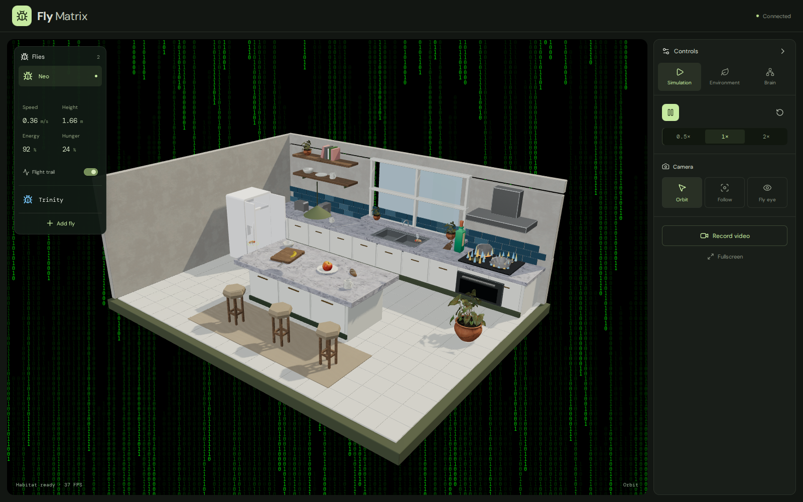
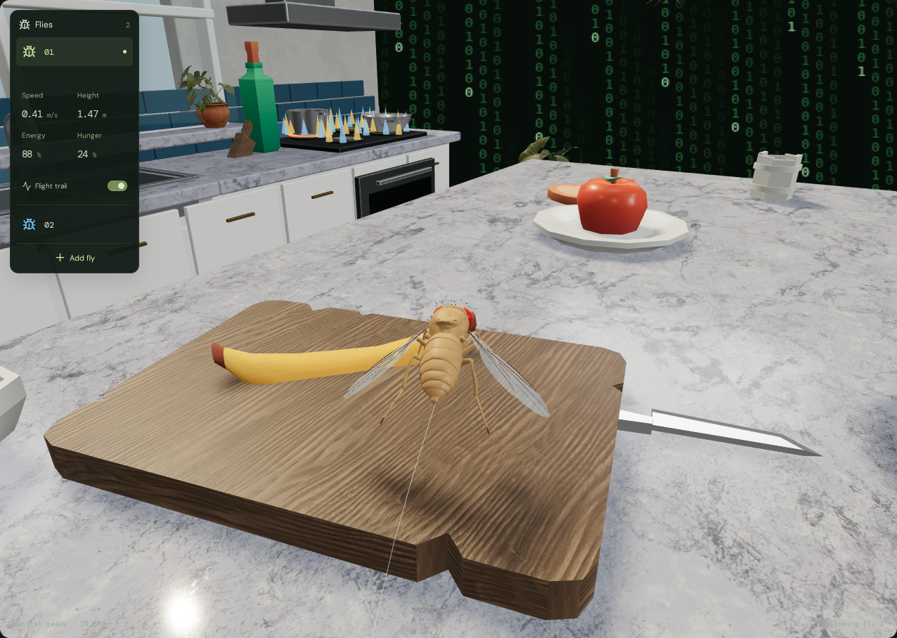
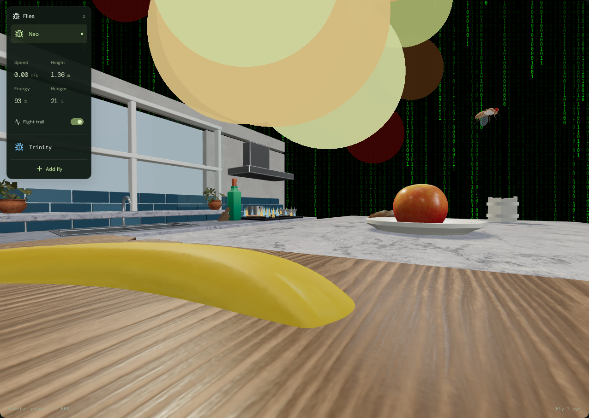
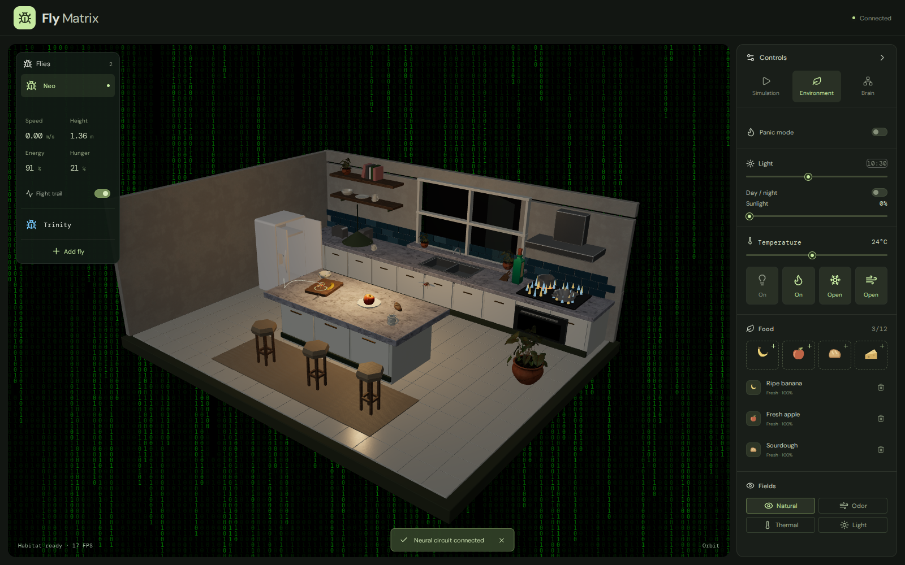
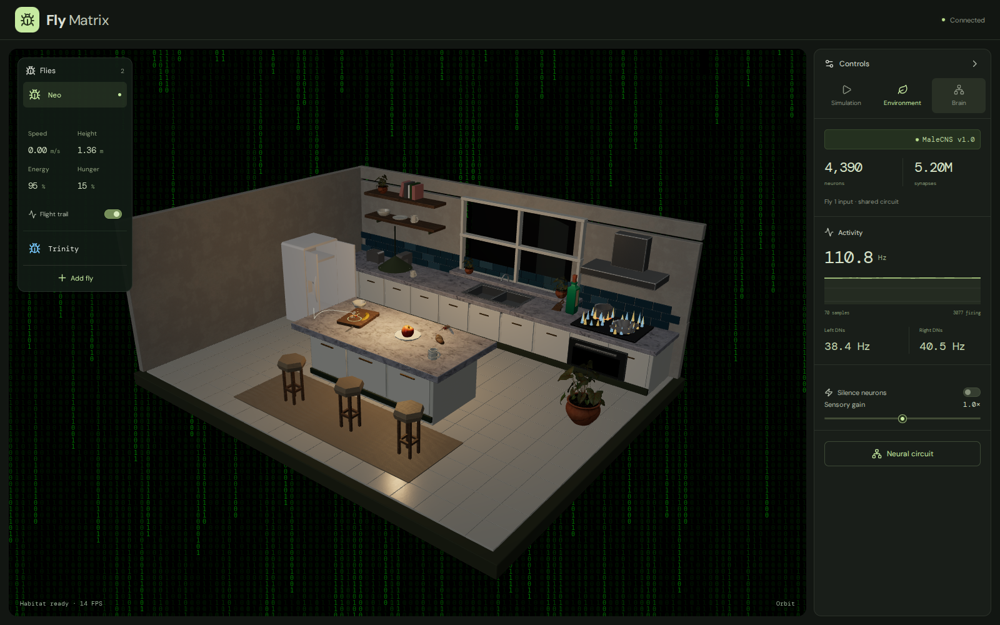
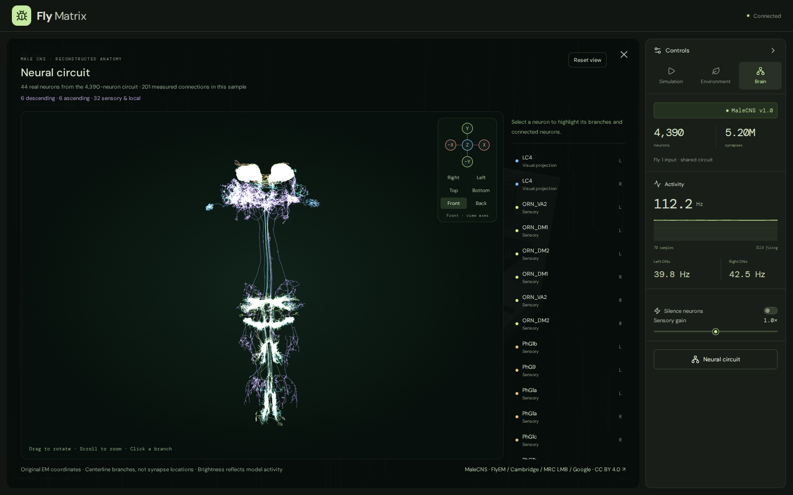

# Fly Matrix

**I put a fly into the Matrix.**

The MaleCNS connectome is an electron-microscopy reconstruction of an adult male
*Drosophila* CNS: roughly 166,700 neurons and on the order of 125 million synapses, traced
rather than estimated. This project takes that wiring, treats the synapse counts as network
weights, gives it a body with senses, and drops it into a simulated kitchen.



A 28 second walkthrough is in [docs/video/fly-matrix.mp4](docs/video/fly-matrix.mp4): orbit,
follow camera, fly eye, the reconstructed circuit, then back to the kitchen.

The kitchen generates sensory input from its own contents and routes each signal to the
population that would receive it in a real fly: heat and cold to thermosensory neurons, food
to gustatory neurons, light to visual projection neurons. Activity propagates through the
real MaleCNS connectivity as leaky integrate-and-fire dynamics, and descending-neuron firing
is decoded back into movement.

The result is a fly that flies. It explores, collides with other flies, burns energy, goes
hungry, hunts for food, feels the stove, and reacts to a room that keeps changing.

React + TypeScript + Three.js + Rapier frontend; Python + FastAPI + Pydantic + Poetry backend.

## What it cost

**A sample, not a brain.** 166,700 neurons will not run at interactive rates. The import
seeds from annotated sensory populations and expands three hops along the strongest
downstream connections: **4,390 real neurons and 5,202,110 real synapses**. Strong paths
survive; much recurrent and peripheral wiring does not.

**Synapse count stands in for strength.** Anatomical contact does not mean one neuron must
drive another, but the dataset annotates no physiological strength, so weights are synapse
count times transmitter sign, following Shiu et al., *Nature* 2024. Real synapses also vary
in release probability, receptor type, timing and adaptation. None of that is modeled.

**Nothing is trained.** No backpropagation, no reinforcement learning, no gradients. The
structure is the connectome; NumPy/SciPy integrate it directly. This fly cannot learn.

**It is excitation-heavy.** Selecting the strongest outgoing paths truncated the inhibition
that would balance them, so the circuit ignites on its own and keeps flying with no input at
all. Real flies rest. This is measured and regression-tested, not hidden: see
[Scientific scope](#scientific-scope).

## Run

```bash
./start.sh
```

Opens **http://localhost:5176**; Ctrl-C stops both services. Needs Python 3.11–3.14 and
Node 20.19+ or 22.12+. The first launch installs Poetry and dependencies locally and needs
internet; everything then runs offline.

## Settings

`.env`, copied from `.env.example` on first launch and ignored by Git. Restart after
changing ports.

| Key | Default | Purpose |
|---|---|---|
| FRONTEND_PORT | 5176 | Browser entry point |
| BACKEND_PORT | 8106 | FastAPI service; the frontend proxy follows this |
| FRONTEND_HOST | 0.0.0.0 | Frontend bind address |
| BACKEND_HOST | 127.0.0.1 | Backend bind address |
| NEUPRINT_API_KEY | empty | Only to refresh the supplied circuit |
| NEUPRINT_DATASET | male-cns:v1.0 | Dataset for the explicit import script |
| NEURAL_SEED | 42 | Reproducible session seed |
| MAX_SESSIONS | 4 | Concurrent neural WebSocket sessions |
| DATA_DIR | .data | Local runtime data directory |

One backend worker; each browser gets its own neural state. No database, no LLM.

## Play

| Follow camera | Fly eye |
|---|---|
|  |  |

- **Two flies** to start, **Add fly** up to 12. Select one for its speed, height, energy and hunger.
- Drag flies and food to move them. Drag empty space to orbit, scroll to zoom.
- Click the lamp, fridge, window or stove to toggle them.
- Cameras: **1** orbit, **2** follow, **3** fly eye. **Space** pauses. Room speed 0.5x/1x/2x.
- Place food from the Environment tab, then click a surface. Odor, thermal and light overlays show approximate fields.
- **Hunger** rises as the stomach empties; food seeking starts at 10%. Food rots over minutes after a meal.
- Heat, cold, starvation and hard impacts cost energy.
- **Record video** captures the 3D view at 30 FPS as WebM or MP4.

Each fly has its own physics, energy and stomach, but there is one shared circuit: the
selected fly supplies the sensory input and every fly receives its motor output.



## Scientific scope





**4,390 neurons, 251,004 directed connections and 5,202,110 synapses**, 259 of them
descending. A bounded real MaleCNS circuit, not the whole CNS. The sensory encoders, motor
readout, body scale, flight controller and environment fields are explicit approximations.
This is not a validated reconstruction of fly behavior.

Two limitations are large enough to state here. Both are measured and regression-tested:

**The circuit saturates.** It ignites on its own within ~800 ms of neural time and then holds
a self-sustaining state. Sensory gain at zero still leaves about 84% of the firing rate, and
rates pin to the 455 Hz refractory ceiling rather than to plausible values. Sensory input
modulates the circuit; it does not gate it. **Silence neurons** is what actually clears it.

**Only some senses steer.** The motor decoder is engineered, not biological. Light gives a
real left/right differential (1.22 separation, sign reversing with side), and taste and
temperature move the output clearly. **Odor does not steer**: unilateral odor separates left
from right by 0.077, below the ±0.16 null spread. Food approach is the engineered
odor-gradient controller and physics, not neural olfactory navigation. Thermal avoidance,
food seeking and feeding are hard-coded rules reading raw sensors, and `stomach`/`energy` are
game variables with no link to any neuron.

Full equations, sources and limitations: [docs/science.md](docs/science.md).

## Develop

```bash
.cache/poetry/bin/poetry install
.venv/bin/python -m pytest -q
cd frontend && npm ci && npm run build
npm run test:e2e   # needs ./start.sh running; first run: npx playwright install chromium
```

Two checks start and stop their own instance on free ports, so they never collide with a
copy you are running:

```bash
python3 scripts/test_launcher.py   # startup, port conflicts, Ctrl-C, child reaping
python3 scripts/test_browser.py    # Playwright interaction and neural checks
```

Data refreshes are explicit and outside the startup path: `scripts/import_connectome.py` and
`scripts/import_anatomy.py` run read-only neuPrint queries with the server-side credential,
`scripts/fetch_assets.py` and `scripts/fetch_materials.py` reproduce the local models and
CC0 material maps.

## Credits

MaleCNS v1.0 from [FlyEM/HHMI Janelia](https://male-cns.janelia.org/download/), the
University of Cambridge, the MRC Laboratory of Molecular Biology and Google Research,
licensed [CC BY 4.0](https://creativecommons.org/licenses/by/4.0/). Fly meshes and plant
models: [docs/assets.md](docs/assets.md). Neural model after
[Shiu et al.'s reference implementation](https://github.com/philshiu/Drosophila_brain_model).
